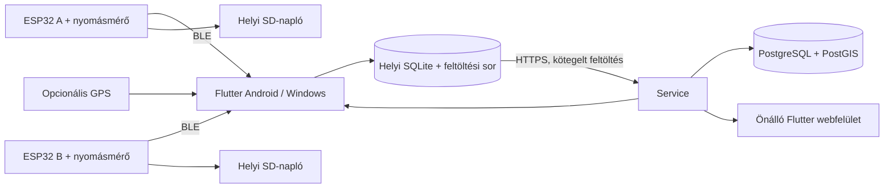

# Nyomásmérő V2 – rendszerterv

2026-10-03 · **Jóváhagyott és megvalósított kliens/firmware terv.** Eredmények: [README](README.md); használat/build: [BUILD.md](BUILD.md). A valódi hardveres és service-integrációs próba külön szükséges.

## 1. Javasolt megoldás

Két ESP32 egy-egy nyomásmérőt olvas, BLE-n küld adatot a Flutter alkalmazásnak. Az app helyben rögzít, elérhető GPS esetén automatikusan helyet rendel a mintákhoz, majd feltölti őket. GPS nélkül is időbélyeges nyomásadat készül és kerül a service-be; térképre csak érvényes helyadatú minta kerül. Ugyanazon Flutter-projekt önálló webes kiadása mutatja az eszközöket, előzményeket és a fiók közös nyomáshőtérképét.

A két érzékelő **azonos mérés két, akár redundáns csatornája**; az eredeti appban nincs eltérő mélységre vagy geometriai elrendezésre utaló adat. Az A/B értékek külön megmaradnak, térképi összevonásuk egyenlő súlyú. Egy fiókhoz több eszközpár tartozhat, több telefon egyszerre dolgozhat; egy gyűjtő app első változatban egy kiválasztott párt kezel.

**Határ:** itt a firmware, Android/Windows app és webes kliens készült el. A service megvalósítása másik fejlesztési feladat; kész átadása: [rendszerterv](service/SYSTEM.md), [interfész](service/INTERFACE.md), [Codex-prompt](service/CODEX_PROMPT.md).

## 2. Hardver és kompatibilitás

A V1 ESP32/Arduino forrásának és kétcsatornás App Inventor alkalmazásának vizsgálatán alapul. A V2 a bekötést őrzi; új BLE-protokollt és natív ESP-IDF C++ firmware-t használ. A V1 szenzordriver CRC-pufferhibáját és hibás méréskezelését kijavítottuk. Kapcsolási rajz és fizikai készülék ellenőrzése még szükséges.

### Megőrzendő hardverkiosztás

Forrás: a V1 `pinout_v1_0.h`, `main.cpp`, `SD_task.cpp` és `PTE7300_I2C.cpp` állományai.

| Funkció | ESP32 GPIO / cím | Bizonyosság |
|---|---|---|
| RGB LED R/G/B | 32 / 33 / 25, magas szinttel bekapcsolva | Kódban explicit |
| SD / BT LED | 27 / 13 | Kódban explicit |
| BT / SD gomb | 34 / 35, aktív alacsony | Kódban explicit; külső felhúzás szükséges |
| Akkumérés | 26 = ADC2_CH9, 12 bit, 0 dB | Kódban explicit |
| SD CS | 5 | `SD.begin(5)` |
| SD SCK / MISO / MOSI | 18 / 19 / 23 | Az `esp32dev` Arduino alapértelmezéséből következik; bemérendő |
| I²C SDA / SCL | 21 / 22 | A `Wire.begin()` alapértelmezéséből következik; bemérendő |
| PTE7300 | 7 bites cím: 0x6C; CRC-s tranzakció: 0x6D | A meglévő driverből; a 0xDA a CRC-s írás 8 bites címbájtja |
| DS3231 | Ugyanazon I²C busz, 0x68 | A használt RTC típusa alapján |

A V2 minden buszlábát explicit konfigurálja. A GPIO34/35 belső felhúzására nem támaszkodik. Wi-Fi nem szükséges; az internetkapcsolatot az app adja. Az akkufeszültség V1 korrekciója `(ADC_mV - 17) * 4.341`; ezt kiinduló kalibrációként, ellenőrzött tartománnyal őrizzük meg, nem univerzális konstansként.

### Buildkörnyezet

Flutter 3.35.4 / Dart 3.9.2, ESP-IDF 6.0.2; cél `esp32`. A [BUILD.md](BUILD.md) és a [GitHub workflow](.github/workflows/build.yml) rögzíti az önálló buildet és teszteket. Gépspecifikus segédek nem szükségesek a repóhoz.

## 3. Használat és felületek

1. E-mail + jelszó regisztráció, e-mail-megerősítés; később jelszó-visszaállítás.
2. **Eszköz hozzáadása:** BT gomb hosszan → közeli készülék kiválasztása → eszközazonosítás/párosítás → fiókhoz rendelés. A teljes azonosító mellett rövid név és azonosító LED-villogtatás segít.
3. **Pár létrehozása:** két saját eszköz A/B szerepben, szabad névvel. Az A/B a párhoz tartozik, ugyanaz a firmware kerül mindkét készülékre.
4. **Mérés:** pár kiválasztása, automatikus kapcsolódás, opcionális munkanév, Start/Stop. Az app azonnal jelez, ha csak az egyik csatorna működik; a másik mérése folytatódik.
5. **Előzmények / térkép:** időszak, pár vagy eszköz szerinti szűrés; alapértelmezésben a fiók minden párjának közös térképe. Egy mérés kiválasztásával görbe, útvonal és adatminőség is látszik.

Négy fő nézet: **Mérés · Térkép · Előzmények · Eszközök**. Nagy, kontrasztos A/B nyomásértékek és akkujelzés; alul élő görbe, GPS- és feltöltési állapot. A ritkán szükséges kézi csatlakozás/bontás az eszköz menüjében marad. Magyar felület, álló/fekvő telefon és átméretezhető Windows-ablak.

A web önálló böngészős felület, beágyazott WebView nélkül. Ugyanazokat a saját eszközöket, állapotokat, méréseket és hőtérképet éri el; BLE-adatgyűjtést a natív app végez. A web eszközkiválasztása szűrés és részletezés, nem távoli BLE-csatlakoztatás.

Service nélküli kipróbáláshoz külön **helyi mód** van. Ezek a mérések nem kerülnek utólag automatikusan másik fiókba; CSV-ben exportálhatók. Fiókkal indított mérés internetkimaradás után ugyanabba a fiókba töltődik fel.

## 4. Firmware és BLE

**Natív C++ / ESP-IDF 6.0.2, beépített NimBLE, NVS, FatFS.** A meglévő ESP-IDF az ESP32-höz is dokumentál NimBLE-t; az elérhető SDK-ban a kapcsolati paraméterfrissítés és a supervision timeout is megvan. [Espressif dokumentáció](https://docs.espressif.com/projects/esp-idf/en/v6.0.2/esp32/api-reference/bluetooth/nimble/index.html)

Kevés, világos felelősség: szenzor+idő, BLE, SD-író, gomb/LED/akku. A busz közös zárolást kap; SD- és BLE-művelet nem blokkolhatja a mintavételt. A mintasorok korlátosak; túlcsordulás számlált hiba, nem csendes adatvesztés. NVS-írás csak beállításváltozáskor.

| Működés | Tervezett alapérték |
|---|---|
| Mintavétel és értesítés | **10 Hz**, valóban új szenzorminta, méréskori monoton időbélyeggel |
| BLE kapcsolat | Egy gyűjtő/készülék; az app két kapcsolatot tart |
| Kapcsolati kérés | 30–50 ms interval, latency 0, **2000 ms supervision timeout**; az elfogadott érték külön látható |
| Újracsatlakozás | Egy közös scanner, eszközönként állapotgép; 1/2/4/8/15 s késleltetés kis szórással; kézi bontás letiltja az adott automatikát |
| Hirdetés | Bekapcsolva és bontás után automatikusan; rövid gyors, majd takarékos hirdetés, nem áll le végleg 30 s után |
| Akku | Bekapcsoláskor és 30 s-onként feszültség + becsült SOC; hibánál ismeretlen, nem 0% |
| SD | Helyi gombbal kapcsolható, beállítása megmarad; saját időbélyeges CSV, legfeljebb 1 s-os írási puffer |

A 2 s timeout **kérés**, az Android/Windows Bluetooth-központ felülbírálhatja. A kimaradt csomagokat ez nem pótolja. 500 ms óta változatlan mintánál a kijelzés elavultnak jelölt; új sorszám nélkül nincs új minta.

### V2 adatmodell a rádión

Új V2 service/characteristic UUID-k; a V1 négybájtos karakterisztikája nem kap új jelentést. A meglévő készülékeket V2 firmware-re kell frissíteni. A kompatibilitási cél a hardverkiosztás, nem a régi App Inventor kliens változatlan működtetése.

Javasolt értesítés: **20 bájt**, little-endian, alap MTU-val is elfér; explicit kódolás, nem C++ struct memóriaátküldése.

| Mező | Bájt | Jelentés |
|---|---:|---|
| `version`, `flags` | 1 + 1 | Verzió 2; mérésérvényes, RTC-érvényes, SD-aktív/hiba, akkualacsony, szenzorhiba |
| `seq` | 4 | Minden mintavételi kísérletkor növekszik, hibánál is |
| `uptime_ms_low` | 4 | Méréskori monoton idő alsó 32 bitje |
| `pressure_pa` | 4 | Előjeles Pa; érvénytelen mérésnél `INT32_MIN` |
| `battery_mv`, `soc_pct` | 2 + 1 | Ismeretlen: 65535 / 255 |
| `reserved`, `raw_count` | 1 + 2 | Tartalék 0, eredeti előjeles szenzorkód |

Kapcsolódáskor olvasott **Info**: `device_id`, indulásonként véletlen 128 bites `boot_id`, teljes 64 bites uptime, firmware/protokoll verzió, szenzorsorozatszám, kalibrációs profil. Külön **Control/Result**: azonosító villogtatás, időegyeztetés/RTC-beállítás, SD-vezérlés, tulajdonba vételi challenge. Kérésazonosító, végrehajtási válasz, legfeljebb 512 bájtos üzenet és 2 s összeállítási időkorlát. A 20 bájtos darabolás automatizált tesztje megvan; valódi MTU 23-as kapcsolat még ellenőrizendő. Pontos szerződés: [contracts/ble.md](contracts/ble.md).

A BLE link ellenőrzése mellett protokollverzió, pontos hossz, sorszám és érvényességjelző kell; külön alkalmazási CRC nem szükséges. **A szenzor saját I²C CRC-jét viszont ellenőrizni kell.** A PTE státuszregisztereihez és hibajelzéseihez a gyártói leírás az irányadó, nem a régi driver vak másolása. [Sensata kommunikációs útmutató](https://www.sensata.com/sites/default/files/a/sensata-pte7300-pressure-sensor-installation-and-communication-guideline.pdf)

### Idő és helyi SD

A monoton mérési idő az elsődleges. Kapcsolódáskor több rövid kérés-válasz alapján az app eszköz-uptime ↔ saját monoton idő ↔ UTC megfeleltetést készít, majd percenként ellenőrzi. A legkisebb köridős mérésből számol, tárolt bizonytalansággal. Új `boot_id`, telefonóra-ugrás vagy kapcsolatváltás új időszegmenst indít; a 32 bites idő túlcsordulását a teljes uptime alapján kezeli.

Az app érvényes idővel beállíthatja a DS3231-et; lemerült RTC mellett is működik a BLE-mérés. Az SD minden sorhoz a tényleges `boot_id/seq/uptime` azonosítót írja, és csak igazolt időnél UTC-t. Az időbeállítás külön időhorgony, nem írja át a régi sorokat. A CSV tartalmazza a nyers és Pa értéket, állapotot, akkufeszültséget és profilazonosítót.

Internetkimaradáskor a telefon tárolása teljes értékű. BLE-kieséskor a telefon nem lát új mintát; az aktív SD-napló őrzi azt, de az első kiadásban nincs automatikus SD→BLE visszatöltés. SD nélkül ez az időszak valódi mérési rés marad. A részleges utolsó CSV-sor és az utolsó, legfeljebb 1 s-os puffer áramvesztéskor elveszhet; ezt a vizsgálatnak ki kell mutatnia.

## 5. Eszközazonosság, fiók és párok

- Tartós ID: `hps-` + az eFuse gyári alap-MAC 12 kisbetűs hex számjegye. Nem a változható BLE-cím és nem a hirdetett név az azonosító. Az ID nyilvános, önmagában nem jogosultság.
- Egy készüléknek egy aktuális tulajdonosfiókja lehet. Egy fiók több párt tart; egy eszköz egyszerre egy aktív pár tagja. Párcsere nem módosít korábbi mérési adatot.
- Minden készülék egyszeri USB-előkészítéssel egyedi véletlen eszköztitkot és BLE-párosítási PIN-t kap; a titok a firmware NVS-ébe és a service védett eszköznyilvántartásába kerül. A PIN a készülékhez adott címkén olvasható. Előkészítés: [fw/PROVISIONING.md](fw/PROVISIONING.md).
- Hosszú BT-gombnyomás 120 s-ra engedélyezi az új BLE-bondot és a claim-műveletet. LE Secure Connections + egyedi PIN; a platform párosítási párbeszéde használható. Ismert bond automatikusan visszakapcsolódhat. Egyszerre egy gyűjtő kapcsolódik.
- A bejelentkezett app rövid életű service-challenge-et továbbít; a készülék HMAC-válasszal igazolja a titok birtoklását. A service egyszer használja fel a challenge-et, és tranzakcióban rendeli a készüléket a fiókhoz. A titkot az app nem kapja meg. Pontos bizonyítékformátum: [interfész](service/INTERFACE.md).
- Tulajdonosváltás az első változatban adminisztrált, szinkronizálás utáni átadás, új eszköztitok/PIN és törölt bondok mellett. Gombos reset nem veheti el más felhőbeli tulajdonjogát. A korábbi mérések a korábbi fióknál maradnak.

Az első regisztrációhoz/claimhez internet szükséges; későbbi mérés a helyben megőrzött fiókkal és eszközökkel offline is indulhat. Másik fiók tokenjével régi helyi adat nem tölthető fel. Több személy közös szervezeti fiókja és szerepkörei későbbi bővítés; most egy regisztráció egy saját adatteret jelent.

Ez felhasználói adatgyűjtő rendszer: a service ellenőrzi a tulajdonjogot és az adatformátumot, de a telefon által beküldött minden nyomás/GPS-minta eredetiségére nincs külön hardveres aláírás. Fizikai flash-kiolvasás elleni védelem külön termékesítési döntés; a terv nem igényel fejlesztéskori eFuse-módosítást.

## 6. App, offline tárolás és Android-életciklus

Egy Flutter-kódbázis, platformadapterekkel. Egyszerű modellek, szolgáltatások és `ChangeNotifier`/streamek; nincs szükség általános pluginrendszerre vagy nagy állapotkezelési keretrendszerre.

| Rész | Feladat |
|---|---|
| `measurement/` | BLE-állapotgépek, protokoll, időillesztés, mérésindítás/leállítás |
| `storage/` | SQLite, sémafrissítés, feltöltési sor, helyi előzmények/CSV |
| `platform/location_source.dart` | Külön GPS-bemenet; `HAS_GPS=false` esetén nem indul |
| `sync/` | HTTPS-kliens, auth, újrapróbálás, fiókhoz kötött szinkron |
| `core/grid.dart`, `ui/map.dart` | Közös aggregálás, színskála, térkép, minőségjelzés |
| `ui/` és `platform/` | Felületek, natív jogosultságok/háttérfutás, webes adapterek |

**Függőségek:** `bluetooth_low_energy`, `flutter_map`, `geolocator`, SQLite (`sqflite`/`sqflite_common_ffi`), HTTP, UUID, path_provider és natív tokentároláshoz `flutter_secure_storage`. A meglévő SDK-val feloldott verziókat az [app/pubspec.lock](app/pubspec.lock) rögzíti.

Androidon egy megtartott FlutterEngine birtokolja a BLE-t, GPS-t, tokent és adatbázisírást; az Activity újralétrehozása nem indít második motort. Rövid natív `RecordingService` ad foreground értesítést és CPU-ébrentartást. Egy tulajdonosa van a kapcsolatoknak és a tokenfrissítésnek. A háttérben futó rögzítés nem a UI újrarajzolásához kötött; a foreground_task csomag nem szükséges. Az értesítés visszanyitja az appot a leállításhoz.

A mérést látható appból indítjuk, tartós értesítéssel; leállítás az appban. Service-típus: `connectedDevice`, engedélyezett GPS-nél `location` is; megfelelő BLE-, hely- és foreground jogosultságokkal. Engedély megtagadásakor világos állapot, a GPS hiánya nem akadályozza a nyomásnaplót. Képernyőzár/appváltás melletti működést valódi telefonon kell igazolni; force-stop vagy rendszerfolyamat-kilövés után a következő indulás helyreállítja a naplót és jelzi a megszakadást. [Android BLE háttérműködés](https://developer.android.com/develop/connectivity/bluetooth/ble/background), [service-típusok](https://developer.android.com/develop/background-work/services/fgs/service-types)

Cél: Windows 10/11 x64 és Android 8+; a kiadások helyben lefordultak. Android 12 előtti BLE-kereséshez rendszeroldali helyengedély GPS nélküli használatnál is szükséges lehet. Windows alatt a programnak futnia kell; aktív méréskor megakadályozza az automatikus alvást, kézi alvásból visszatéréskor rést jelez és újracsatlakozik.

### Tartós rögzítés és feltöltés

Minden minta először SQLite-tranzakcióba kerül, legfeljebb 250 ms-os kötegeléssel; ugyanott lesz feltöltésre váró. A UI elkülöníti az élő és a már mentett állapotot. Az első kiadás célja legfeljebb 250 ms még memóriában levő adat elvesztése appösszeomláskor; tartósan mentett adat nem veszhet el.

- Öt másodpercenként feltöltés, legfeljebb 500 minta / 512 KiB kérés; a pontos sikerlista után lesz feltöltött. Hálózati hiba: exponenciális újrapróbálás, változatlan azonosítókkal.
- Mintaazonosság: `(device_id, boot_id, seq)`. Azonos ismétlés sikeres, eltérő tartalmú ismétlés konfliktus. A GPS-hozzárendelés véglegesítése megelőzi a feltöltést.
- A GPS-re még váró minta is tartósan tárolódik. Az illesztési ablak lezárásáig helyben kiegészíthető; újrainduláskor a megőrzött fixekből véglegesítjük, elégtelen fixnél hely nélkül. Feltöltött rekord már változatlan.
- Munkamenet és párosítási/kalibrációs pillanatkép helyben keletkezik, így offline is indítható. A lezárás csak minden köteg visszaigazolása után kerül a service-re.
- Tokenlejárat megállítja a feltöltést, de nem a helyi mérést. Fiókváltás lezárja az aktív mérést; külön helyi adattár és fiókazonosítós feltöltési sor marad.
- Sikertelen lemezírásnál a rögzítés hibára áll, a kijelzés folytatódhat; nincs csendes felülírás. Feltöltetlen adat automatikusan nem törlődik. A hosszú műszakhoz előre biztosítani kell a szabad tárhelyet.
- Két eszköz, 10 Hz, 8 óra: **576 000 nyers minta**. Ezzel kell bemérni a tárhelyet és a visszajátszást; a grafikon csak látható időablakot tart memóriában.

A mérés és a helyi előzmény internet nélkül is használható. A web első változatban online kliens; nem kap második offline mérési adatbázist.

## 7. GPS és a közös hőtérkép jelentése

**GPS nélkül teljes értékű marad:** BLE, két élő csatorna, akku, grafikon, időbélyeges helyi napló, feltöltés és előzmény. A helyadatok nullable mezők. A GPS-modul külön buildben is elhagyható; a mag nem importál helyszolgáltatást, és az Android-manifestből a GPS-specifikus elemek kivehetők.

Alapforrás a telefon helyszolgáltatása, kért 1 Hz frissítéssel; a tényleges időköz és pontosság tárolandó. Windows alatt csak ténylegesen elérhető helyforrás használható, pontossági szűréssel; a laptop helyadata nem tekinthető automatikusan GNSS-nek. Külső USB/NMEA/RTK adapter bővíthető, de nem része az első kiadásnak.

A minta az **adatfelvétel idejéhez**, nem a BLE-érkezés vagy feltöltés idejéhez kap helyet. Rövid, legfeljebb 3 s-os illesztési ablakban két érvényes fix között interpolálunk. Alapkorlát: fixek közti rés ≤2 s, pontosság mindkét végén ≤10 m, időillesztési bizonytalanság ≤100 ms. Enélkül a nyomás megmarad, de `location=null`/minőségi hibajel kerül mellé; nincs régi hely korlátlan ismétlése vagy hosszú kiesésen át húzott útvonal. Az eredeti GPS-fixek is megmaradnak.

Mindkét csatorna a gyűjtő telefon helyét kapja. Antenna–mérőpont geometriai korrekciót az ismeretlen szerelési adatokból nem találunk ki; a telefon GPS-e és a traktor geometriája korlátozza a térbeli pontosságot.

### Mit mutat a szín?

**Nyomást bar-ban**, nem közvetlenül talajsűrűséget vagy hitelesített tömörségi százalékot. Az átszámításhoz mechanika, hatásos felület/áttétel, mélység és terepi kalibráció kellene. A nyers Pa érték és a szenzorprofil megmarad, ezért később bevezethető igazolt agronómiai mutató.

A hőtérkép első változata színezett, alapból **10 m-es mérési cellákat** használ. Nem pontsűrűséget színez, és nem fest ki nem mért területet. Az algoritmus appban és service-ben ugyanaz:

1. Csak érvényes nyomás, megfelelő hely/időminőség és haladás közbeni minta kerül a színátlagba. Induló sebességküszöb 0,5 m/s; álló vagy ismeretlen sebességű adat megmarad, külön megtekinthető. Szűrő kikapcsolása tudatos opció.
2. UTC-másodpercenként, csatornánként nyomásátlag képződik. A két csatorna átlagából egy párérték lesz; egy hiányzó csatornánál a meglévő marad, csökkentett lefedettségjelzéssel. A hely a másodperces ablak közepére illesztett GPS-hely.
3. Egy cellán belül munkamenetenként átlagolunk; a kiválasztott munkamenetek cellaátlagai azonos súllyal adják a közös értéket. Így több értesítés vagy két redundáns szenzor önmagában nem növeli a súlyt.
4. A cella értéke, minimuma, maximuma, mintaszáma, csatorna- és munkamenetszáma lekérdezhető. Külön A/B réteg és nyers pontnézet segíti az ellenőrzést.

A rács helyi UTM vetületben, a vetület origójához rögzített egész cellaindexekkel készül; a kérés/válasz tartalmazza az EPSG-t és a cellaméretet. Egy nézet UTM zónáját a megnyitáskori középpont választja ki, azon belül nem változik pásztázáskor. A kliens és service közös tesztadatokon egyezik. Nagy területnél durvább rács kell, nem több százezer böngészős pont. A térképi aggregáció megvalósítható a [PostGIS méretezhető négyzetrácsával](https://postgis.net/docs/ST_SquareGrid.html).

A bar-skála rögzített és azonos minden páron/kliensen; kiindulásként a megerősítendő 0–200 bar tartomány. A szűrés vagy zoom nem változtatja észrevétlenül a színek jelentését. A tényleges érték nincs a színskálához levágva. Eltérő mechanikájú/kalibrálatlan berendezések összehasonlíthatósága külön ellenőrzendő.

A teljes fióktérkép adatforrása a service. Offline az app a helyben elérhető méréseket mutatja, látható „helyi adatok” jelzéssel; a másik telefon feltöltetlen adatait nem ismerheti. Félig feltöltött helyi sessiont nem adunk még egyszer a service cellaátlagaihoz. Az aktuális mérés helyi pontjai külön élő rétegként követhetők.

Alaptérképhez konfigurálható csempeszolgáltató és látható attribúció kell. Hálózat nélkül a helyi mérési réteg és koordináták működnek, az alaptérkép csak rendelkezésre álló cache-ből jelenhet meg. Előre letölthető teljes offline térképet csak erre jogosító szolgáltatóval vezetünk be; a nyilvános OSM csempeszerver erre nem használható. [OSM csempehasználati feltételek](https://operations.osmfoundation.org/policies/tiles/)

## 8. Service és webes állapot

Egyszerű HTTPS REST service, PostgreSQL/PostGIS, e-mail-küldés és statikus Flutter web. Kezdetben nincs szükség MQTT-re, WebSocketre vagy mikroszolgáltatásokra. A böngésző öt másodpercenként kér friss állapotot; mérési adat a köteg feltöltése után látszik. Részletek kizárólag a [service-tervben](service/SYSTEM.md) és az [interfészben](service/INTERFACE.md).

Az app helyi BLE-állapota és a service állapota külön fogalom. A web **friss adat / gyűjtő elérhető, eszköz nem / utoljára látva** állapotokat mutat. Tíz másodperces friss jelenlétjelzés, 30 s lejárat; régi offline adatok feltöltése nem állítja online-ra a készüléket. Internet nélkül a távoli felület tényleges pillanatnyi készülékállapotot nem ismerhet.

## 9. Dani kéréseinek beépítése

| Kérés | Döntés |
|---|---|
| Két élő nyomás + grafikon + akku | Alapfunkció, csatornánkénti frissességgel és hibajelzéssel |
| 100 ms értesítés | Valós 10 Hz mintavétellel együtt |
| 2 s BLE supervision | Firmware-kérés + elfogadott érték ellenőrzése; platformfüggő eredmény |
| Automatikus csatlakozás, kézi tartalék | ID-alapú állapotgép, közös scanner, kézi menü |
| Appnapló | SQLite, CSV-export, internetfüggetlen gyűjtés |
| RTC javítása telefonról | Védett BLE-időparancs; monoton idő marad az elsődleges |
| Nyomással színezett térkép | Közös fióktérkép, világos bar-skála és adatminőség |
| Kivehető GPS-upgrade | Elkülönült modul, GPS nélküli kiadás és teszt |
| Flutter, jó megjelenés | Meglévő SDK; egyszerű, nagy kontrasztú, reszponzív felület |

## 10. Megvalósítási sorrend és elfogadás

| Szakasz | Eredmény és ellenőrzés |
|---|---|
| 0. Egyeztetés | A felhasználó jóváhagyta a tervet és az implementációt; GPS-hozzárendelés automatikus. |
| 1. Kockázatos kapcsolatok próbája | Meglévő toolchainnel ESP32/Windows build; szükséges Android eszközök pótlása; két valós BLE-eszköz, PIN/bond, MTU 23, újracsatlakozás, Android képernyőzár + GPS + SQLite. A választott pluginok csak sikeres próba után véglegesek. |
| 2. Firmware + mérőapp | Rögzített BLE-szerződés és közös tesztvektorok; nyomás, RTC, SD, gombok, kétcsatornás offline rögzítés, GPS nélküli változat. |
| 3. GPS + térkép | Időillesztés, nyers fixek, minőségi szűrés; helyi nyomáshőtérkép, nyers export. |
| 4. Fiók + service-integráció + web | A másik fejlesztő OpenAPI-ja és contract-tesztjei; claim, auth, idempotens szinkron, önálló webes előzmények és közös térkép. |
| 5. Terepi átadás | Telepíthető APK, Windows csomag, web build, firmware image és rövid build/flash/provisioning útmutató; kalibráció és hosszú próba. |

Az elfogadás lényegi esetei:

- 2 × 10 Hz, legalább 8 órás képernyőzárt Android-próba és Windows-próba; nincs megmagyarázatlan rés, a hibák számláltak. Cél: helyi élő kijelzés tipikusan ≤300 ms, online webfrissülés ≤10 s.
- Bluetooth-kikapcsolás, egyik készülék kiesése/újraindulása, MTU 23, 32 bites időfordulás: nincs csatornacsere, duplázás vagy frissnek mutatott régi adat.
- Legalább 1 órás hálózatkimaradás, majd appújraindítás, tokenlejárat, köteg újraküldése: minden tartós minta pontosan egyszer kerül a service-be.
- GPS nélkül, megtagadott engedéllyel és pontatlan/kieső GPS-szel is működik a nyomásnapló; nincs hamis térképi hely. Óraugrás nem rendezi át a mintákat.
- Két külön fiók egymás ID-it próbálva sem olvas/ír; claim-visszajátszás és párba foglalt idegen eszköz tiltott. Egy fiók két párja egyszerre gyűjt és egy térképen jelenik meg.
- Ugyanaz a rögzített adatkészlet appban és weben azonos cellaértéket/színt ad; redundáns csatorna nem duplázza a térképi súlyt. A valódi nulla nyomás különbözik a hiányzó adattól.
- Nincs SD, megtelt SD, hibás RTC, szenzor-CRC hiba, betelt telefonlemez és fizikai áramvesztés: látható, következetes állapot, sérült minta nem válik érvényessé.

## 11. Még megbeszélendő

| Pont | Tervezési alapállás |
|---|---|
| Érzékelő pontos cikkszáma, tartománya, tényleges panel/bekötés, akku | V1 forrás alapján tervezve; firmware kiadása előtt ellenőrizendő |
| Mérés fizikai jelentése | Azonos/redundáns A/B, a felhasználó pontosítása szerint; a kijelzett mennyiség nyomás |
| Webes felület | Önálló böngészős Flutter web, a felhasználó pontosítása szerint |
| Windows terepi helyforrás | Alapból OS-helyforrás, ha elég pontos; egyébként GPS nélküli gyűjtés |
| Kezdeti provisioning | USB-n egyedi titok + PIN, védett service-import; lásd fw/PROVISIONING.md |
| Üzemeltetés | API/web domain, e-mail-szolgáltató, térképcsempe-szolgáltató és mentési cél még nincs kijelölve |

A firmware és kliens megvalósult. A fordítás és az automatizált teszt nem helyettesíti a valódi kétkészülékes próbát, a nyomás/GPS bemérését és a másik projektben készülő service-integrációt.
